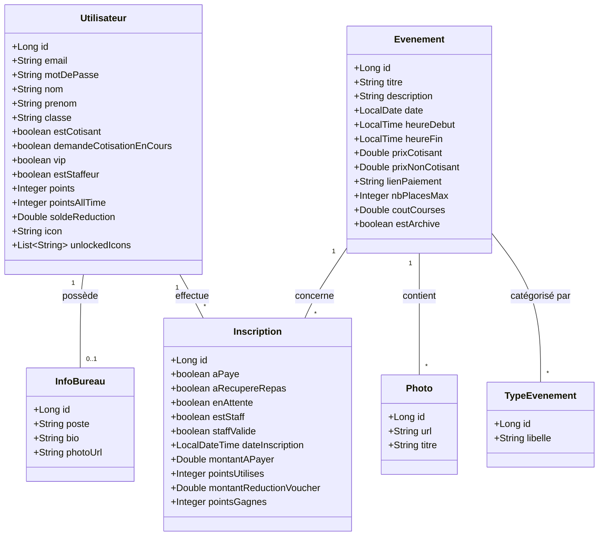

# Documentation Technique - Pause-Web

Bienvenue sur le Wiki du projet **Pause-Web**. Ce document référence l'architecture des données, les règles de gestion et les spécificités techniques de l'application de gestion de "La Pau'se".

---

## 1. Modèle Conceptuel de Données (MCD)

Ce diagramme représente la structure de la base de données et les relations entre les entités.

---

## 2. Dictionnaire des Données

### 👤 Utilisateur
L'acteur central de l'application. Il peut être un étudiant standard ou un membre du bureau.

| Attribut | Type (Java) | Description |
| :--- | :--- | :--- |
| **id** | `Long` | Identifiant technique (Clé primaire). |
| `email` | `String` | Identifiant de connexion (Unique). |
| `motDePasse` | `String` | Mot de passe. |
| `nom` | `String` | Nom de famille. |
| `prenom` | `String` | Prénom. |
| `classe` | `String` | Promotion de l'étudiant (ex: "Ing1", "Prepa2"). |
| `estCotisant` | `boolean` | **Vrai** si la cotisation BDE est active pour l'année. |
| `demandeCotisationEnCours` | `boolean` | **Vrai** si une preuve de paiement est en attente de validation admin. |
| `vip` | `boolean` | Statut donnant accès aux avantages VIP (coupe-file, etc.). |
| `estStaffeur` | `boolean` | Statut global indiquant que l'élève fait partie de l'équipe staff (bénévoles). |
| `points` | `Integer` | Solde actuel de points utilisables (Gamification). |
| `pointsAllTime` | `Integer` | Somme totale des points gagnés (pour le classement général). |
| `soldeReduction` | `Double` | Porte-monnaie virtuel (en €) acquis via les points. |
| `icon` | `String` | Identifiant de l'icône de profil actuelle. |
| `unlockedIcons` | `List<String>` | Liste des IDs d'icônes que l'utilisateur a débloquées. |

### 🎉 Evenement
Représente une soirée, un afterwork ou une activité.

| Attribut | Type (Java) | Description |
| :--- | :--- | :--- |
| **id** | `Long` | Identifiant technique. |
| `titre` | `String` | Nom de l'événement. |
| `description` | `String` | Détails (Lieu, ambiance, menu...). Max 1000 cars. |
| `date` | `LocalDate` | Date de l'événement. |
| `heureDebut` | `LocalTime` | Heure de commencement. |
| `heureFin` | `LocalTime` | Heure de fin estimée. |
| `prixCotisant` | `Double` | Tarif préférentiel. |
| `prixNonCotisant` | `Double` | Tarif plein. |
| `lienPaiement` | `String` | URL vers la billetterie externe (Lydia/Wero). |
| `nbPlacesMax` | `Integer` | Capacité maximale (`null` si illimité). |
| `coutCourses` | `Double` | Coût organisationnel (pour stats BDE). |
| `estArchive` | `boolean` | **Vrai** une fois l'événement passé (ne s'affiche plus en accueil). |

### 📝 Inscription
Table de jointure complexe gérant l'état d'un utilisateur pour un événement donné.

| Attribut | Type (Java) | Description |
| :--- | :--- | :--- |
| **id** | `Long` | Identifiant technique. |
| `aPaye` | `boolean` | Confirme que le paiement a été reçu. |
| `aRecupereRepas` | `boolean` | Validé lors du scan QR Code à l'entrée/au repas. |
| `enAttente` | `boolean` | **Vrai** si l'événement était plein au moment de l'inscription. |
| `estStaff` | `boolean` | **Vrai** si l'utilisateur travaille spécifiquement sur cet événement. |
| `staffValide` | `boolean` | Validation finale par le bureau (débloque les points/récompenses). |
| `dateInscription` | `LocalDateTime`| Horodatage de la demande d'inscription. |
| `montantAPayer` | `Double` | Prix final gelé au moment de l'inscription. |
| `pointsUtilises` | `Integer` | Nombre de points brûlés pour réduire le prix. |
| `montantReductionVoucher` | `Double` | Valeur en euros de la réduction points. |
| `pointsGagnes` | `Integer` | Points crédités une fois l'événement terminé/validé. |

### 🏷️ TypeEvenement
Catégorisation pour le filtrage (Tag).

| Attribut | Type (Java) | Description |
| :--- | :--- | :--- |
| **id** | `Long` | Identifiant unique. |
| `libelle` | `String` | Nom (ex: "Soirée", "Afterwork", "Sport"). |

### 📸 Photo
Galerie d'images liée à un événement.

| Attribut | Type (Java) | Description |
| :--- | :--- | :--- |
| **id** | `Long` | Identifiant unique. |
| `url` | `String` | Chemin de stockage de l'image. |
| `titre` | `String` | Légende de la photo. |

### 👔 InfoBureau
Extension du profil pour les membres du BDE.

| Attribut | Type (Java) | Description |
| :--- | :--- | :--- |
| **id** | `Long` | Identifiant unique. |
| `poste` | `String` | Rôle (ex: "Trésorier"). |
| `bio` | `String` | Description publique du membre. |
| `photoUrl` | `String` | Photo officielle du membre. |

---

## 3. Règles de Gestion

### 💰 Gestion des Tarifs & Paiements
1.  **Calcul du prix :** Lors de l'inscription, le système vérifie le booléen `Utilisateur.estCotisant`.
    * Si `true` → `Inscription.montantAPayer` prend la valeur de `Evenement.prixCotisant`.
    * Si `false` → `Inscription.montantAPayer` prend la valeur de `Evenement.prixNonCotisant`.
2.  **Utilisation de réduction :** Si l'utilisateur utilise son `soldeReduction`, le `montantAPayer` est diminué d'autant, et le solde est débité.

### ⏳ Gestion des Places (Liste d'attente)
1.  Si le nombre d'inscriptions (où `enAttente == false`) atteint `Evenement.nbPlacesMax` :
    * Toute nouvelle inscription est créée avec `enAttente = true`.
2.  Si une place se libère (désistement), l'admin peut passer un utilisateur de la liste d'attente vers la liste principale manuellement.

### 🛠️ Gestion du Staff
Le système distingue deux niveaux de "Staff" :
1.  **L'attribut Utilisateur `estStaffeur`** : C'est un rôle global. L'étudiant fait partie du pool de bénévoles. Il a accès à l'interface de candidature staff.
2.  **L'attribut Inscription `estStaff`** : L'étudiant a été sélectionné pour travailler sur *cet* événement précis. Il ne paie pas sa place (`montantAPayer = 0`).
3.  **Validation (`staffValide`)** : Après l'événement, un admin valide que le staffeur a bien fait son travail. Cela déclenche l'attribution des points bonus.

### 🎮 Gamification (Points & Icônes)
* **Gagner des points :** Les points sont attribués lors de la participation aux événements ou lors de la validation d'une mission staff.
* **Dépenser des points :** Les points peuvent être convertis en `soldeReduction` (€) ou utilisés pour débloquer des `icons` cosmétiques.
* **Icônes :** Un utilisateur ne peut équiper l'icône "X" que si "X" est présent dans sa liste `unlockedIcons`.

---

## 4. Notes Techniques pour les Développeurs

* **Gestion de l'Argent :** Utilisation de `Double` pour simplifier le développement initial
* **Dates :** Utilisation de l'API `java.time` (`LocalDate`, `LocalDateTime`, `LocalTime`)
* **Stockage des icônes :** La liste `unlockedIcons` est gérée via une `@ElementCollection` (JPA)
* **Sécurité & Authentification :** L'authentification est gérée manuellement via `jakarta.servlet.http.HttpSession` (stockage de l'objet User en session)

---

# Auto-évaluation

| Critère | Points | Justification |
| :--- | :---: | :--- |
| **Fonctionnalités** | **10/10** | |
| L'application contient bien les fonctionnalités demandées | | **Oui** : L'application permet de gérer toute l'association de "La Pau'se": les étudiants peuvent s'inscrire aux événements, payer en ligne (avec tarif cotisant/non-cotisant), et gagner des points de fidélité |
| L'application permet d'insérer, mettre à jour, supprimer, chercher une entité en BDD | | **Oui** : Ajouter un événement, modifier le profil d'un utilisateur, ou annuler une inscription |
| L'application permet de lier deux entités en BDD | | **Oui** : un événement contient plusieurs photos, et un événement possède plusieurs types (Soirée, caritatif,...) |
| L'application permet, pour une entité donnée, de créer un lien à une autre entité en BDD | | **Oui** : Quand un étudiant s'inscrit à un event ou débloque des icones |
| L'application est jolie / utilise un framework CSS | | **Oui** : Le site est propre et responsive grâce à **Bootstrap 5** avec des couleurs coherentes avec l'association |
| **Technique** | **5/5** | |
| L'application utilise le design pattern MVC pour chaque fonctionnalité | | **Oui** : Les Vues (HTML) affichent ce que les Contrôleurs préparent, en utilisant les Services pour la logique |
| Les controlleurs utilisent les méthodes HTTP: GET,POST,PUT,DELETE | | **Oui** : Récupération des pages (GET), envoi des formulaires (POST), et mise à jour des données (PUT, DELETE) -> @GetMapping, @PostMapping, @PutMapping, @DeleteMapping |
| Chaque vue manipule des données transmises par son controlleur | | **Oui** : Tout vient du serveur via Thymeleaf (le nom de l'utilisateur, la liste des soirées...) |
| **Soutenance et Evaluation individuelle** | **?/5** | |
| La soutenance est bien préparée | | **Oui** : Entraînement en amont + Présentation des fonctionnalités puis revue du code|
| Chacun parle suffisamment | | |
| Le timing est respecté | | |
| Les réponses aux questions sont correctes | | |
| Le repo comporte des commits réguliers de chaque membre du groupe | | **Oui** : Historique des commits git |
